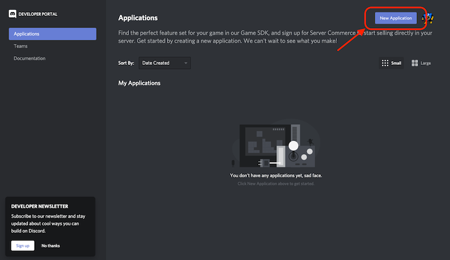

# Discord ZeroTier Bot

## Intro

As part of the recent BSides Vancouver CTF, we were using ZeroTier as our VPN provider to enable access to the challenges.
We created a `private` ZeroTier network and were manually authorizing player machines that were joining the CTF.

**Discord ZeroTier Bot** automates ZeroTier node authorization and allows users of your Discord server request their node authorization, and will also reference ZeroTier node to the Discord user that requested the authorization.

## Setup

### Step 1 - .env file

Create the `.env` file to use as config:

```bash
cp template.env .env
````

### Step 2 - Discord Bot

1. You need a Discord user account, and admin access to t he Discord server where you want to use the Bot.
1. Head to [Discord Developer Portal](http://discordapp.com/developers/applications), login, and create a new app. I'd suggest you name it `ZeroTier Bot` (this will be the username for your Bot in Discord).

1. Create a Bot for your application by clicking Bot in the application settings, then select `Add Bot`.

1. Copy the Bot token and save it in the `.env` as `DISCORD_TOKEN`

### Step 3 - Authorize the Bot

1. In the application settings, select `OAuth2`, then select `bot` under `Scopes`.
1. Under `Bot Permissions` select `Send Messages` and `Use Slash Commands`.

1. Open the displayed URL and authorize the Bot in your Discord server.

### Step 3 - ZeroTier

1. Login to ZeroTier.
1. Go to your `Account` settings and create a new API token.

1. Save the token in the `.env` file as `ZT_TOKEN`.
1. Save the network ID in the `.env` as `ZT_NETWORK` (create a new network if you haven't yet).

### Step 4 - Start the Bot

Build the Docker image:

```bash
docker build -t discord-zerotier-bot .
```

Start the Bot:

```bash
docker run --rm -it --env-file .env discord-zerotier-bot
```

## Usage

**Note:** *once the bot is started, it may take up to an hour for the slash commands to register on your server.
If the bot isn't showing any errors, have a bit of patience.*

The following slash commands will now be available in your server:

* `/zerotier help` - show help message
* `/zerotier register` - request node authorization

The bot will add Discord username of the requesting user as the `name` for the nodes that it authorizes. The bot also checks if string `ban` is present in the node description and will not authorize those nodes, this allows node banning in ZeroTier. Users have to join the network first before requesting ZeroTier authorization through the Bot.

## TODO

* Add a restricted `/zerotier ban` command to ban nodes.